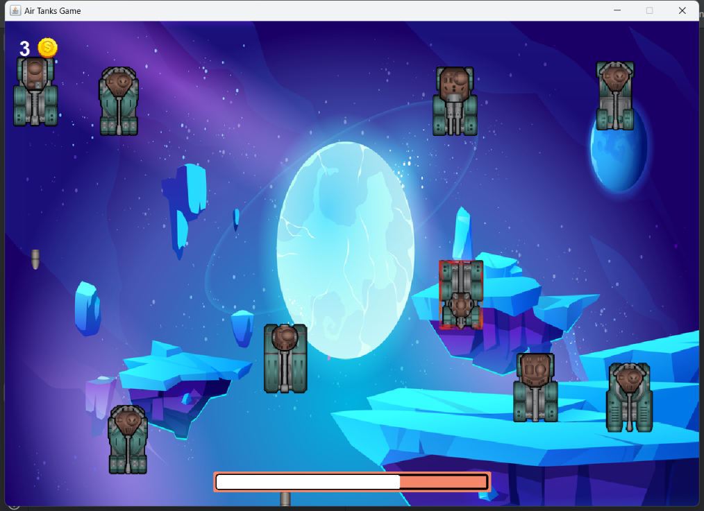
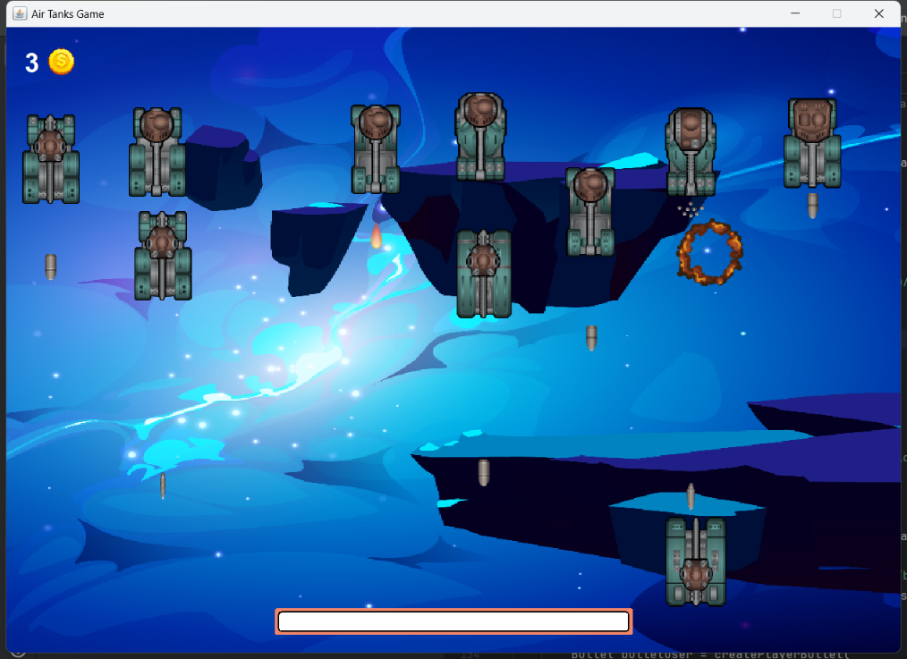
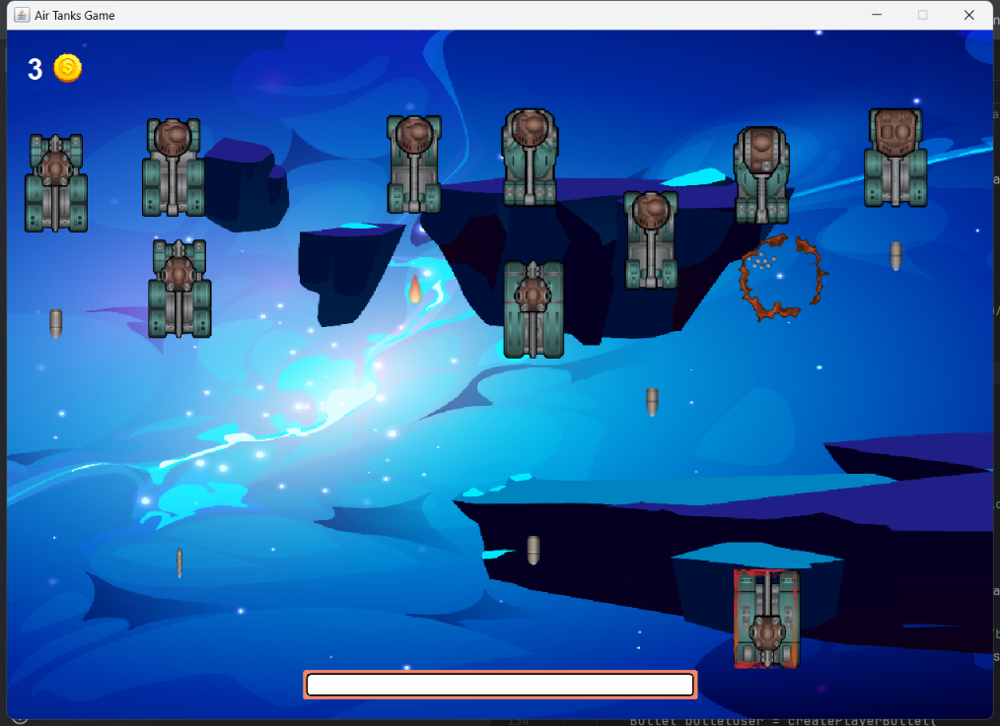
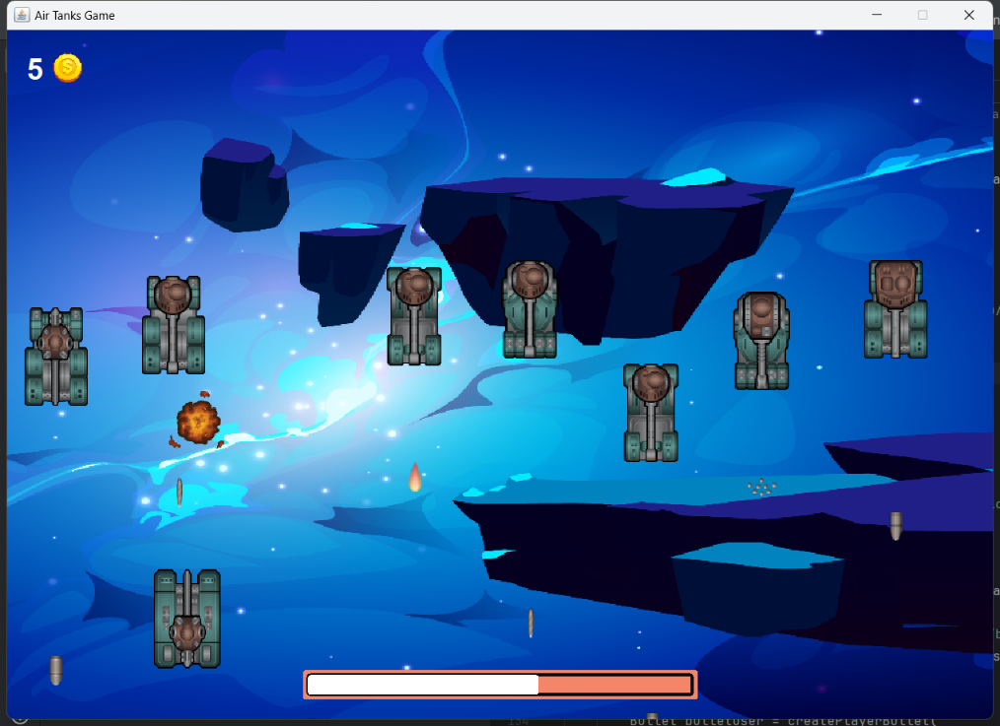
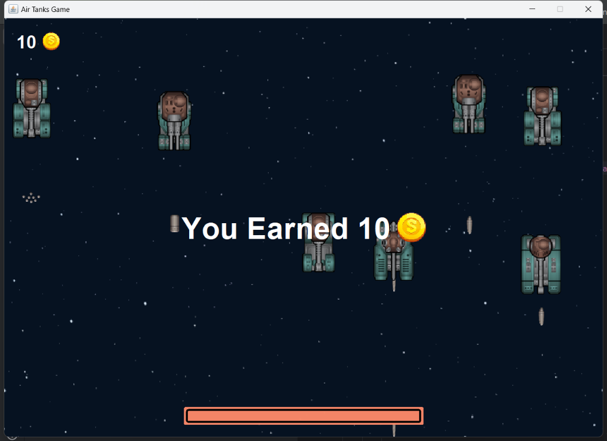

# AirTanksGame

## About
There a lot of enemy tanks that attack from forward. They
run and shoot towards the player. The player moves his tank 
through the WASD keys and can shoot by pressing the space.
The bar at the bottom of the window show your health. Once you got
shot it will shrink and there is no way to heal. The coin icon in the
top-left corner shows the money you have collected so far. For every 
tank, you destroy 1$ would be added and for every tank that escapes 2$
is taken. The goal of the game is to get the maximum money within the 
timeframe you are still alive.

## Example Pictures

